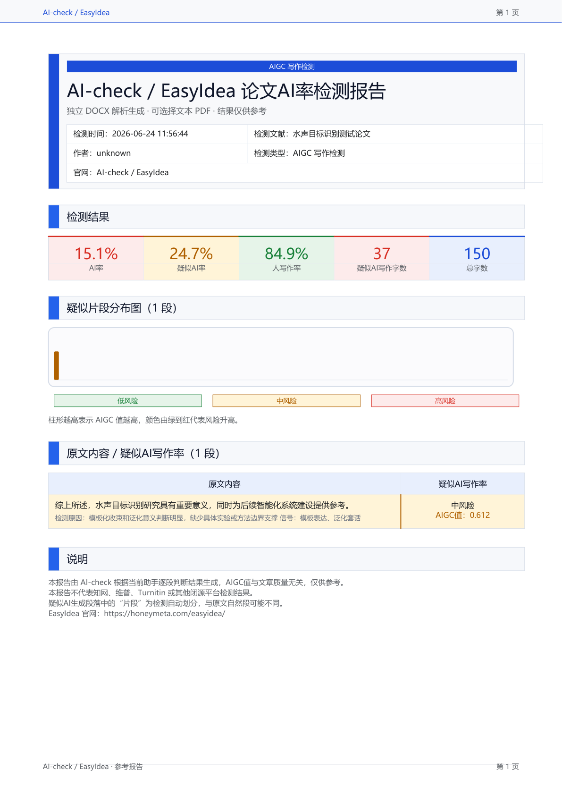

# AI-check Skills

AI-check Skills 是一个面向 Codex、Claude Code、OpenCode 等 AI 编程助手的开源 Skill，用于
Word/DOCX 论文 AI 率检测报告生成、自动化降 AI 率、重复率/AI 写作风格清理与确认后改写。

> 该功能是 [EasyIdea 科研工作台](https://honeymeta.com/easyidea) 的一小部分。如果你需要完整
> 的论文写作、DOCX 工作台、报告导入、标注修改、批量审阅和一键采纳/放弃能力，欢迎下载使用：
> https://honeymeta.com/easyidea



## 功能亮点

- 从 `.docx` 中读取正文、摘要、结论等论文内容。
- 自动切分长文本，生成适合 AI 助手逐段判断的 chunk。
- 提取可解释的 AI 写作风险信号，例如模板化表达、连接词密集、泛化套话、句式节奏过于均匀等。
- 同时记录缓和信号，例如引用编号、实验指标、模型/方法名、领域方法细节和定量结果支撑。
- 由当前 AI 助手在可见对话中判断 `aigcValue`、verdict、reason 和 signals，脚本本身不黑箱打分。
- 生成美观、可选择文本的 AI 率检测 PDF/HTML 报告。
- 在用户确认后，将改写方案写入新的 DOCX，不会原地修改原文档。
- 支持 Codex、Claude Code、OpenCode，以及其他能运行本地脚本的 agent runtime。

## 独立 DOCX/PDF 管线

AI-check Skills 不依赖 LibreOffice、`soffice`、Microsoft Word 自动化、DOCX 转 PDF 渲染或截图渲染。

- DOCX 解析和写回：`python-docx`
- PDF 报告生成：`reportlab`
- 确定性信号提取：仓库内置 Python 脚本

脚本不会调用 AI 模型，也不会自行输出最终 AI 概率。AI 助手负责逐段判断与改写，用户可以看到判断依据。

## 安装

```bash
python -m pip install python-docx reportlab
```

运行测试：

```bash
python -m pip install pytest
```

## 目录结构

```text
ai-check/
  SKILL.md
  agents/openai.yaml
  scripts/
    ai_check.py
    ai_rewrite_docx.py
  references/
    ai_rate_signals.md
    report_format.md
  assets/
    report_template.html
docs/
  assets/
    ai-check-report-preview.png
tests/
  test_ai_check.py
```

## 快速开始

扫描 DOCX，生成确定性的 chunk 和 traceFeatures：

```bash
python ai-check/scripts/ai_check.py scan paper.docx --out work/scan.json
```

`scan.json` 会包含 chunk 和可解释信号，但不会包含最终 AI 概率。AI 助手应读取每个 chunk，并生成类似下面的
results JSON：

```json
{
  "documentTitle": "paper",
  "author": "unknown",
  "results": [
    {
      "chunkId": "chunk-0001",
      "sensitivity": "medium",
      "aigcValue": 0.62,
      "verdict": "suspicious",
      "reason": "模板化收束和泛化价值判断较明显，具体实验支撑不足",
      "signals": ["泛化套话", "连接词密集"]
    }
  ]
}
```

生成 AI 率报告：

```bash
python ai-check/scripts/ai_check.py report work/scan.json work/results.json --out-dir work/report
```

报告命令会输出：

- 可选择文本的 PDF 报告
- HTML 报告
- summary JSON

用户确认修改方案后，将替换写入新的 DOCX：

```bash
python ai-check/scripts/ai_rewrite_docx.py apply paper.docx work/replacements.json --out paper.ai-check.rewritten.docx
```

原始 DOCX 不会被原地修改。

## 示例提示词

- `Use AI-check to generate an AI writing rate report for F:\papers\main.docx.`
- `根据 AI-check 报告，先给我看需要修改的片段和改写方案，确认后再写出新的 Word。`
- `只检测，不改 Word。`

## 注意事项

- 报告仅供参考。
- 不要宣称结果等同于知网、维普、Turnitin 或其他闭源检测平台。
- 改写时应保留事实、术语、公式、数字、引用编号和结论方向。
- 如果原文缺少证据，不要编造实验、数据、案例或引用；应降低语气、补充边界，或使用已有上下文。

## License

MIT

## English

AI-check Skills is an open-source Codex/OpenCode-style skill for AI-rate report generation,
automated AI-writing reduction, and academic repetition/AI-writing style cleanup. It generates a
polished, selectable-text PDF/HTML report from a Word document, then applies confirmed revisions to
a new DOCX only after user approval.

This project is a small part of [EasyIdea Research Workbench](https://honeymeta.com/easyidea). For a
full research-writing workflow with a live DOCX workbench, report import, annotations, batch review,
and one-click accept/reject, download EasyIdea: https://honeymeta.com/easyidea

### Highlights

- Reads `.docx` files and extracts body, abstract, and conclusion text.
- Splits long academic text into reviewable chunks.
- Extracts explainable AI-writing signals such as template phrases, dense connectors, generic
  claims, and uniform sentence rhythm.
- Keeps mitigating evidence such as citations, metrics, method names, domain details, and
  quantitative results.
- Lets the active AI assistant judge `aigcValue`, verdict, reason, and signals in the visible
  conversation.
- Generates a polished AI-rate report as HTML and selectable-text PDF.
- Applies user-confirmed replacements to a new DOCX without modifying the original document.
- Supports Codex, Claude Code, OpenCode, and similar agent runtimes that can run local scripts.

### Independent Pipeline

AI-check Skills does not require LibreOffice, `soffice`, Microsoft Word automation, DOCX-to-PDF
rendering, or screenshot rendering.

- DOCX parsing and rewriting: `python-docx`
- PDF report generation: `reportlab`
- Deterministic signal extraction: bundled Python scripts

The scripts do not call AI models and do not produce a final AI probability by themselves. The AI
assistant remains responsible for judgment and rewriting so the user can see the reasoning.

### Install

```bash
python -m pip install python-docx reportlab
```

### Quick Start

```bash
python ai-check/scripts/ai_check.py scan paper.docx --out work/scan.json
python ai-check/scripts/ai_check.py report work/scan.json work/results.json --out-dir work/report
python ai-check/scripts/ai_rewrite_docx.py apply paper.docx work/replacements.json --out paper.ai-check.rewritten.docx
```

### Safety Notes

- The report is for reference only.
- Do not claim that it is equivalent to CNKI, VIP, Turnitin, or another closed detector.
- Preserve facts, terminology, formulas, numbers, citation markers, and conclusion direction during
  rewriting.
- If the source lacks evidence, do not invent experiments, data, cases, or citations.
